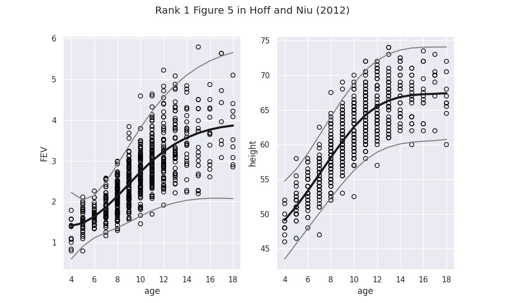
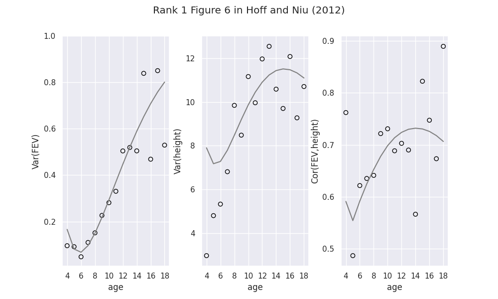

# Python CovRegpy Package
Regularised Covariance regression software project based on Hoff and Niu (2012). This package was developed out of research performed by Cole van Jaarsveldt, Gareth W. Peters, Matthew Ames, and Mike Chantler. This package was built entirely using Python 3.11.5 - Python guarantees backwards compatibility which should ensure that this software package functions as expected on all future Python versions.


# Disclaimer

Our team acknowledges the financial contributions and support of our  benefactors in the production of this research. The authors, owners, and benefactors of this research reserve the right to request compensation  from commercial entities seeking to use our software. All non-commercial usage of this software package is allowed with the associated  permissions, limitations, and conditions as outlined in the GNU General  Public License v3.0. For any commercial usage of this software, the  authors, owners, and benefactors of this research respectfully request  that the commercial entity in question consult the authors, owners, and  benefactors.


## Linux Installation

Create new environment (if needed) with specific version of Python. Python is backwards compatible such that packages working on Python version 3.11 will work on Python version 3.12 et cetera, but the reverse is not true. Python version 3.11 is recommended for the best user experience. A Docker version of the code will be made available in the subsequent major release.

```bash
conda create -n environment_name python=3.11.5
```

Proceed.

```bash
proceed ([y]/n)?
```

Activate new environment.

```bash
source activate environment_name
```

Install specific package versions from attached requirements file. If this is not done first, when pip installing 'CovRegpy', one can not guarantee that all of the required packages downloaded will be those exact versions specified in 'requirements.txt'.

```bash
pip install -r /path/to/requirements/file/requirements.txt
```

Install 'CovRegpy' package.

```bash
pip install CovRegpy
```


## Windows Installation

Create new environment (if needed) with specific version of Python.

```bash
virtualenv --python="/usr/bin/python3.11.5" environment_name
```

Activate new environment. Navigate to environment location or adjust input accordingly.

```bash
C:\path\to\environments> environment_name\Scripts\activate
```

or

```bash
C:> path\to\environments\environment_name\Scripts\activate
```

### Common Error

#### Requests (Caused by SSLError("Can't connect to HTTPS URL because the SSL module is not available.")

https://stackoverflow.com/questions/54135206/requests-caused-by-sslerrorcant-connect-to-https-url-because-the-ssl-module

### Solution

#### Windows 10 | Miniconda 3 | Python 3.11.5

Copy the following files:

- libcrypto-1_1-x64.dll
- libcrypto-1_1-x64.pdb
- libssl-1_1-x64.dll
- libssl-1_1-x64.pdb

from:

```
C:\Users\MyUser\Miniconda3\Library\bin
```

to:

```
C:\Users\MyUser\Miniconda3\DLLs
```

https://stackoverflow.com/questions/45954528/pip-is-configured-with-locations-that-require-tls-ssl-however-the-ssl-module-in/62264725#62264725

https://github.com/conda/conda/issues/8273

Install specific package versions from attached requirements file. If this is not done first, when pip installing 'CovRegpy', one can not guarantee that all of the required packages downloaded will be those exact versions specified in 'requirements.txt'.

```bash
pip install -r path\to\requirements\file\requirements.txt
```

Install 'CovRegpy' package.

```bash
pip install CovRegpy
```


# NEW USERS START HERE

#### https://github.com/Cole-vJ/CovRegpy/blob/main/Jupyter_Notebooks/CovRegpy_new_users.ipynb


## Package Folders Content

- 'aas_figures' - __users can ignore__ - contains figures in associated paper and supplement

- 'B and Psi Estimates' - __users can ignore__ - contains detailed figures and coefficients for our team's additional studies

- #### __'Case Studies'__ - contains all case studies - explore for simple to complex usage examples

- 'experimental_figures' - __users can ignore__ - contains detailed figures exploring automated structure recognition study

- 'figures' - __users can ignore__ - contains detailed figures and coefficient for our team's additional studies

- #### __'Jupyter_Notebooks'__ - contains all Jupyter Notebooks - includes link above for new users and others

- 'README_Images' - __users can ignore__ - contains images for this README file as seen below

- 'S&P500_Data' - __users can ignore__ - contains S&P500 Data for additional studies

- 'weights' - __users can ignore__ - contains all 250 weights resulting from Monte Carlo study of portfolios


## Replicate Output from Hoff and Niu (2012)

```python
import numpy as np
import pandas as pd
import seaborn as sns
import matplotlib.pyplot as plt

from CovRegpy.CovRegpy_RCR import cubic_b_spline, cov_reg_given_mean

plt.rcParams['figure.figsize'] = [10, 8]  # resize figures
sns.set(style='darkgrid')  # style of plot (dark grey background, etc)

# load raw data
raw_data = pd.read_csv('../Peter_Hoff_Data/peter_hoff_data', header=0)
raw_data = np.asarray(raw_data)

# prepare data
peter_hoff_data = np.zeros((654, 3))

for row in range(654):

    if row < 309:
        peter_hoff_data[row, 0] = int(raw_data[row, 0][2])
    else:
        peter_hoff_data[row, 0] = int(raw_data[row, 0][1:3])

    if peter_hoff_data[row, 0] == 3:  # original paper groups those aged 3 into age 4
        peter_hoff_data[row, 0] = 4
    elif peter_hoff_data[row, 0] == 19:  # original paper groups those aged 19 into age 18
        peter_hoff_data[row, 0] = 18
    peter_hoff_data[row, 1] = float(raw_data[row, 0][4:10])  # fev values always 6 text values
    peter_hoff_data[row, 2] = float(raw_data[row, 0][11:15])  # height values always 4 text values

peter_hoff_data = pd.DataFrame(peter_hoff_data, columns=['age', 'fev', 'height'])

# knots and time used in original paper
spline_basis = cubic_b_spline(knots=np.linspace(-17, 39, 9), time=np.linspace(4, 18, 15))
spline_basis = np.vstack((spline_basis, np.linspace(4, 18, 15)))

age_vector = np.asarray(peter_hoff_data['age'])
spline_basis_transform = np.zeros((6, 654))
for col in range(len(age_vector)):
    spline_basis_transform[:, col] = spline_basis[:, int(age_vector[col] - 4)]

coef_fev = np.linalg.lstsq(spline_basis_transform.transpose(), np.asarray(peter_hoff_data['fev']), rcond=None)
coef_fev = coef_fev[0]
mean_fev = np.matmul(coef_fev, spline_basis)

coef_height = np.linalg.lstsq(spline_basis_transform.transpose(), np.asarray(peter_hoff_data['height']), rcond=None)
coef_height = coef_height[0]
mean_height = np.matmul(coef_height, spline_basis)

x_cov = np.vstack((np.ones((1, 654)), (age_vector ** (1 / 2)).reshape(1, 654), age_vector.reshape(1, 654)))
y = np.vstack((np.asarray(peter_hoff_data['fev']).reshape(1, 654),
               np.asarray(peter_hoff_data['height']).reshape(1, 654)))
# mean = np.vstack((np.matmul(coef_fev, spline_basis_transform), np.matmul(coef_height, spline_basis_transform)))
A_est = np.hstack((coef_fev.reshape(6, 1), coef_height.reshape(6, 1)))
B_est, Psi_est = cov_reg_given_mean(A_est=A_est, basis=spline_basis_transform, x=x_cov, y=y, iterations=100)

mod_x_cov = np.vstack((np.ones((1, 15)),
                       (np.linspace(4, 18, 15) ** (1 / 2)).reshape(1, 15),
                       np.linspace(4, 18, 15).reshape(1, 15)))

# mean and covariance plots

cov_3d = np.zeros((2, 2, 15))
for depth in range(np.shape(cov_3d)[2]):
    cov_3d[:, :, depth] = Psi_est + np.matmul(np.matmul(B_est.T, mod_x_cov[:, depth]).reshape(2, -1),
                                              np.matmul(mod_x_cov[:, depth].T, B_est).reshape(-1, 2))

fig, axs = plt.subplots(1, 2, figsize=(8, 5))
fig.suptitle('Rank 1 Figure 5 in Hoff and Niu (2012)')
axs[0].scatter(peter_hoff_data['age'], peter_hoff_data['fev'], facecolor='none', edgecolor='black')
axs[0].plot(np.linspace(4, 18, 15), mean_fev, linewidth=3, c='k')
axs[0].plot(np.linspace(4, 18, 15), mean_fev + 2 * np.sqrt(cov_3d[0, 0, :]), c='grey')
axs[0].plot(np.linspace(4, 18, 15), mean_fev - 2 * np.sqrt(cov_3d[0, 0, :]), c='grey')
axs[0].set_xlabel('age')
axs[0].set_ylabel('FEV')
axs[0].set_xticks([4, 6, 8, 10, 12, 14, 16, 18])
axs[0].set_yticks([1, 2, 3, 4, 5, 6])
axs[1].scatter(peter_hoff_data['age'], peter_hoff_data['height'], facecolor='none', edgecolor='black')
axs[1].plot(np.linspace(4, 18, 15), mean_height, linewidth=3, c='k')
axs[1].plot(np.linspace(4, 18, 15), mean_height + 2 * np.sqrt(cov_3d[1, 1, :]), c='grey')
axs[1].plot(np.linspace(4, 18, 15), mean_height - 2 * np.sqrt(cov_3d[1, 1, :]), c='grey')
axs[1].set_xlabel('age')
axs[1].set_ylabel('height')
axs[1].set_xticks([4, 6, 8, 10, 12, 14, 16, 18])
axs[1].set_yticks([45, 50, 55, 60, 65, 70, 75])
plt.show()

fig, axs = plt.subplots(1, 3, figsize=(8, 5))
plt.subplots_adjust(left=None, bottom=None, right=None, top=None, wspace=0.3, hspace=None)
fig.suptitle('Rank 1 Figure 6 in Hoff and Niu (2012)')
axs[0].plot(np.linspace(4, 18, 15), cov_3d[0, 0, :], c='grey')
fev_var = np.zeros_like(np.linspace(4, 18, 15))
for i, age in enumerate(range(4, 19)):
    fev_var[i] = np.var(np.asarray(peter_hoff_data['fev'])[np.asarray(peter_hoff_data['age']) == age])
axs[0].scatter(np.linspace(4, 18, 15), fev_var, facecolor='none', edgecolor='black')
axs[0].set_xlabel('age')
axs[0].set_ylabel('Var(FEV)')
axs[0].set_xticks([4, 6, 8, 10, 12, 14, 16, 18])
axs[0].set_yticks([0.2, 0.4, 0.6, 0.8, 1.0])
axs[1].plot(np.linspace(4, 18, 15), cov_3d[1, 1, :], c='grey')
height_var = np.zeros_like(np.linspace(4, 18, 15))
for i, age in enumerate(range(4, 19)):
    height_var[i] = np.var(np.asarray(peter_hoff_data['height'])[np.asarray(peter_hoff_data['age']) == age])
axs[1].scatter(np.linspace(4, 18, 15), height_var, facecolor='none', edgecolor='black')
axs[1].set_xlabel('age')
axs[1].set_ylabel('Var(height)')
axs[1].set_xticks([4, 6, 8, 10, 12, 14, 16, 18])
axs[1].set_yticks([4, 6, 8, 10, 12])
axs[2].plot(np.linspace(4, 18, 15), cov_3d[0, 1, :] / (np.sqrt(cov_3d[0, 0, :]) * np.sqrt(cov_3d[1, 1, :])), c='grey')
fev_height_cov = np.zeros_like(np.linspace(4, 18, 15))
for i, age in enumerate(range(4, 19)):
    fev_height_cov[i] = np.corrcoef(np.asarray(peter_hoff_data['fev'])[np.asarray(peter_hoff_data['age']) == age],
                                    np.asarray(peter_hoff_data['height'])[
                                        np.asarray(peter_hoff_data['age']) == age])[0, 1]
axs[2].scatter(np.linspace(4, 18, 15), fev_height_cov, facecolor='none', edgecolor='black')
axs[2].set_xlabel('age')
axs[2].set_ylabel('Cor(FEV,height)')
axs[2].set_xticks([4, 6, 8, 10, 12, 14, 16, 18])
axs[2].set_yticks([0.5, 0.6, 0.7, 0.8, 0.9])
plt.show()
```


## Figures






## Contributing

This project is by no means complete or exhaustive.


## References

P. Hoff and X. Niu. 2012. A Covariance Regression Model. Statistica Sinica 22, 2 (2012), 729–753. 

